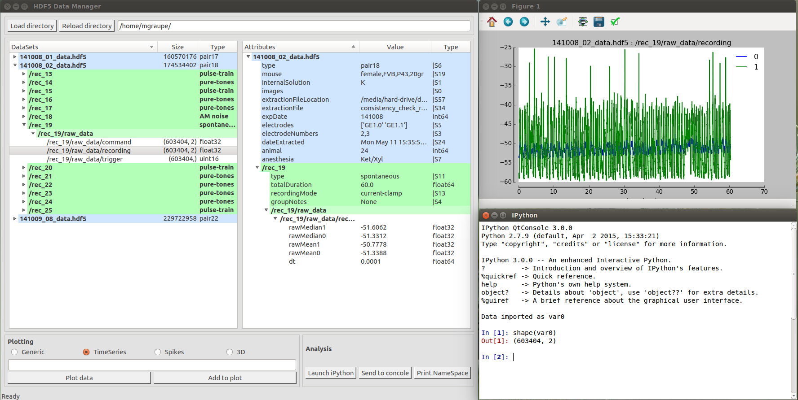

hdf5 Data Manager
=================

The hdf5 Data Manager can be used for viewing, editing, and displaying data and attributes 
stored in the hdf5 format. The viewer is generic and supports any data structure stored in 
the hdf5 format.

### Features
* Groups, Data-sets and Attributes of hdf5 files in a directory can be viewed. File size, Group member number and Data-set size are shown. 
* Attributes can be added and removed. 
* Data can be plotted as generic plot, time-series, spikes and 3D plot (3rd dimension as color code).
* Data can be send to an iPython console which allows further analysis, manipulation or displaying. 



##Built

The graphical user interface is built in **Qt Designer** (Version 4.8.6). The interface file is generated with 
```python
pyuic4 hdf5_manager.ui -o hdf5_manager.py
```

##Built

And the `Data Manager itself is started with 
```python
python h5_manager.py
```

##Requires

Besides standard python packages such as **numpy**, **time**, **sys** etc., the following packages are required :

* h5py
* PyQt4
* glob
* matplotlib
* IPython

##License

This program is free software; you can redistribute it and/or
modify it under the terms of the GNU General Public License
as published by the Free Software Foundation; either version 2
of the License, or (at your option) any later version.

This program is distributed in the hope that it will be useful,
but WITHOUT ANY WARRANTY; without even the implied warranty of
MERCHANTABILITY or FITNESS FOR A PARTICULAR PURPOSE.  See the
GNU General Public License for more details.

You should have received a copy of the GNU General Public License
along with this program.  If not, see <http://www.gnu.org/licenses/>.

